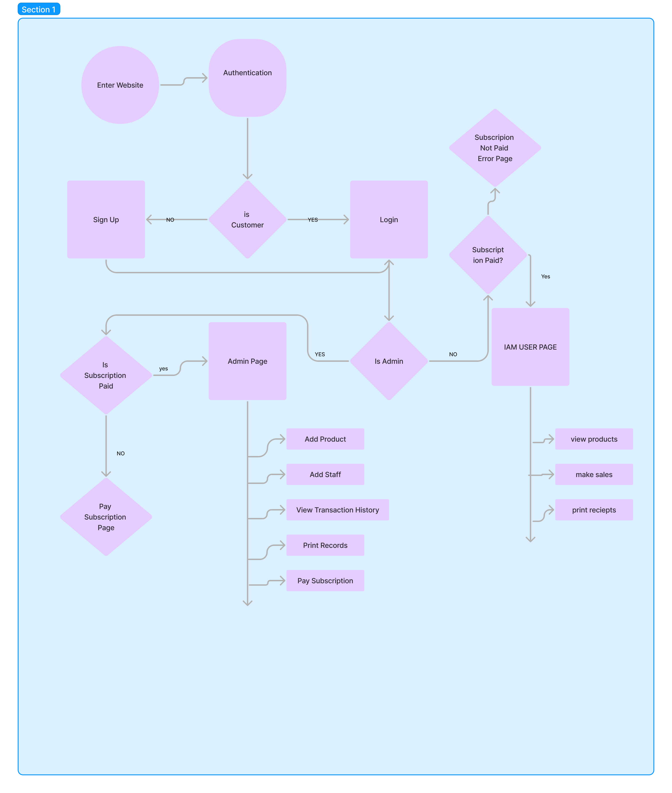

# Good Teller

Welcome to Good Teller, the ultimate financial management solution developed by Abiel Labs. Good Teller is a subscription-based project designed to streamline receipt printing, debt management, payments, and other financial activities for your company. With Good Teller, managing your finances has never been easier.

## About Good Teller

Good Teller is a comprehensive financial management application that simplifies complex financial processes for businesses of all sizes. Whether you're a small startup or a large enterprise, Good Teller offers a range of features to meet your needs. From printing receipts to tracking debts and payments, Good Teller provides the tools you need to stay organized and in control of your finances.

## Key Features

- **Receipt Printing**: Generate professional-looking receipts with customizable templates to reflect your brand identity.
- **Debt Management**: Keep track of outstanding debts, set reminders, and automate debt collection processes.
- **Payment Processing**: Accept payments from customers seamlessly, with support for multiple payment methods.
- **Financial Reporting**: Gain insights into your company's financial health with detailed reports and analytics.
- **Subscription-Based Model**: Enjoy the convenience of a subscription-based service, with flexible pricing plans to suit your budget and requirements.

## Getting Started

To get started with Good Teller, sign up for a subscription plan on our website [here](https://www.goodteller.com). Once you've subscribed, you'll receive access to the Good Teller platform, where you can begin managing your financial activities right away.

## Documentation

For detailed instructions on how to use Good Teller, refer to our [documentation](https://docs.goodteller.com). Here, you'll find user guides, tutorials, and FAQs to help you make the most of the Good Teller platform.

## Support

If you encounter any issues or have questions about Good Teller, our support team is here to help. Contact us via email at support@goodteller.com or visit our [support portal](https://support.goodteller.com) for assistance.

## Contributing

We welcome contributions from the open-source community to improve and enhance Good Teller. If you'd like to contribute code, report bugs, or suggest new features, please see our [contribution guidelines](CONTRIBUTING.md) for more information.

## FlowChart:

Here are some screenshots of our platform in action:

## License

Good Teller is licensed under the [MIT License](LICENSE). See the [LICENSE](LICENSE) file for details.

## About Abiel Labs

Abiel Labs is a leading technology company dedicated to developing innovative software solutions that empower businesses and individuals. To learn more about Abiel Labs and our other projects, visit our [website](https://www.abiellabs.com).

---

© 2024 Abiel Labs. All rights reserved.
